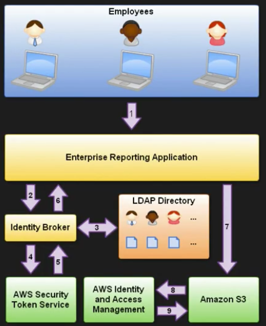

Security Token Service - Grants users limited and temporary access to AWS resources. Users can come from three sources.

1. Federation (typically Active Directory)
	- Uses Security Assertion Markup Language (SAML)
	- Grants temporary access based off the users Active Directory Credentials. Does not need to be a user in IAM
	- Single sign on allows users to log in to AWS console without assiging IAM credentials
2. Federation with Mobile Apps
	- Use Facebook/Amazon/Google or other OpenID providers to log in
3. Cross Account Access
	- Lets users from one AWS account access resources in another

Key Terms:

1. Federation - combining or joining a list of users in one domain (such as IAM) with a list of users in another domain (such as Active Directory, Facebook, etc)
2. Identity Broker - a service that allows you to take an identity from point A and join it (federate it) to point B
	 - you have to develop your own identity broker (does not come out of the box)
3. Identity store - Services like Active Directory, Facebook, Google, etc.
4. Identities - a user of a service like Facebook, etc.

Scenario:

Q: You are hosting a company website on some EC2 web servers in your VPC. Users of the website must log in to the site which then authenticates against the companies active directory servers which are based on site at the companies headquarters. Your VPC is connected to your company HQ via a secure ISPEC VPN. Once logged in the user can only have access to their own S3 bucket. How do you set this up?

A:

Basics:
1. Develop an Identity Broker to communicate with LDAP and AWS STS
2. Identity Broker always authenticates with LDAP first, THEN with AWS STS
4. Application then gets temporary access to AWS resources

Details:
1. Employee enters their username and password
2. the application calls an Identity Broker. The broker captures the username and password. Identity Broker allows us to speak to one identity provider to another.
3. The identity broker uses the organization's LDAP (Lightweight Directory Access Protocol) directory to validate the employee's identity
4. The identity broker calls the new GetFederationTocket function using IAM credentials. The call must include an IAM policy and a duration (1 to 36 hours), along with a policy that specifies the permissions to be granted to the temporary security credentials
5. The security token service confirms that the policy of the IAM user making the call to GetFederationToken gives permission to create new tockets and then returns four values to the application: An access key, a secret access key, a token, and a duration (the token's lifetime)
6. The identity broker returns the temporary security credentials to the reporting application
7. the data storage applicaiton uses the temporary security credentials (including the token) to make requests to Amazon S3
8. Amazon S3 uses IAM to verify that the credentials allow the requested operation on the given S3 bucket and key
9. IAM provides S3 with the go-ahead to perform the requested operation