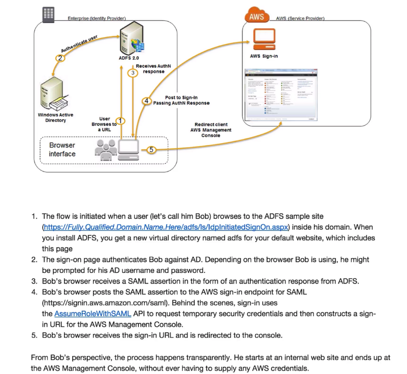

Steps:

1. Go to Corporate Network URL - sign in using active directory credentials (Single Sign On)
2. Recieve a SAML insertion --> basically get a cookie that says you've signed on
3. Browser points to AWS sign on for SAML -> requests temporary sign on credentials and constructs a sign-in URL for AWS
4. browser redirects to URL

Takeaways:
Q: Can you authenticate with Active Directory?
A: Yes, using SAML

- Always authenticate via Active Directory FIRST then assigned temporary security credential 